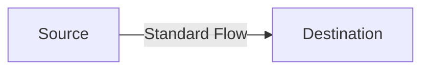
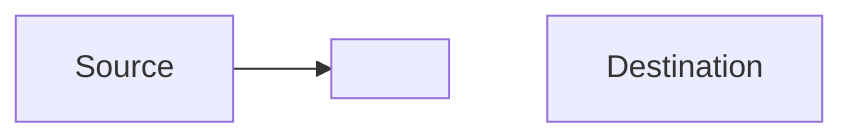
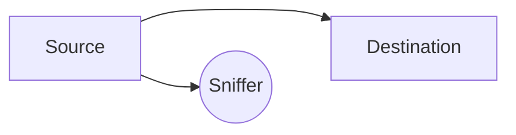
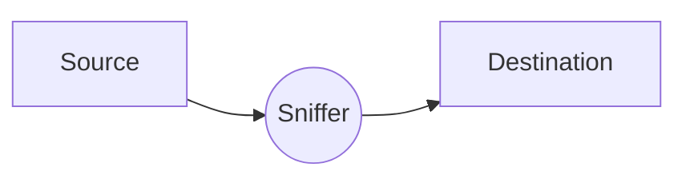
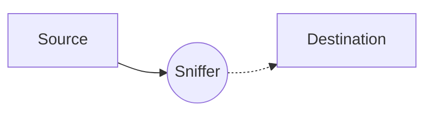
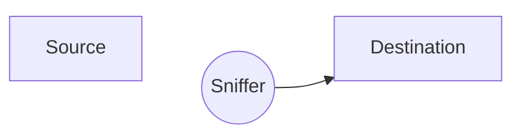

---
tags:
  - uni
  - sem1
---
[[Computer Security|Back to Computer Security home]]
Also part of [[Revision Home|exam revision]]
# Contents
- [[#Security|Security]]
	- [[#Security#Confidentiality|Confidentiality]]
	- [[#Security#Integrity|Integrity]]
	- [[#Security#Availability|Availability]]
- [[#Privacy|Privacy]]
- [[#Trust|Trust]]
	- [[#Trust#Attributes of Trust|Attributes of Trust]]
		- [[#Attributes of Trust#Assurance|Assurance]]
		- [[#Attributes of Trust#Reliability/Resilience|Reliability/Resilience]]
		- [[#Attributes of Trust#Accountability|Accountability]]
	- [[#Trust#Difference between *trust* and *trust<u>worthy</u>*|Difference between *trust* and *trust<u>worthy</u>*]]
- [[#Networking Principles|Networking Principles]]
	- [[#Networking Principles#Packet Switching|Packet Switching]]
		- [[#Packet Switching#Packet Collisions and Switches|Packet Collisions and Switches]]
	- [[#Networking Principles#Stack of Layers|Stack of Layers]]
		- [[#Stack of Layers#Physical Layer|Physical Layer]]
		- [[#Stack of Layers#Link Layer|Link Layer]]
		- [[#Stack of Layers#Network Layer|Network Layer]]
		- [[#Stack of Layers#Transport Layer|Transport Layer]]
		- [[#Stack of Layers#Application Layer|Application Layer]]
		- [[#Stack of Layers#*OSI* Reference Model|*OSI* Reference Model]]
	- [[#Networking Principles#Encapsulation|Encapsulation]]
	- [[#Networking Principles#Protocols (incl. IP & MAC Addresses)|Protocols (incl. IP & MAC Addresses)]]
		- [[#Protocols (incl. IP & MAC Addresses)#IP Addresses|IP Addresses]]
		- [[#Protocols (incl. IP & MAC Addresses)#MAC Addresses|MAC Addresses]]
		- [[#Protocols (incl. IP & MAC Addresses)#TCP|TCP]]
			- [[#TCP#Ports|Ports]]
			- [[#TCP#TCP Packet Format|TCP Packet Format]]
			- [[#TCP#TCP Handshakes|TCP Handshakes]]
			- [[#TCP#Attacks on TCP|Attacks on TCP]]
				- [[#Attacks on TCP#`SYN` Flooding|`SYN` Flooding]]
				- [[#Attacks on TCP#Forged TCP packets|Forged TCP packets]]
				- [[#Attacks on TCP#Smurfing|Smurfing]]
				- [[#Attacks on TCP#TCP Sequence Prediction|TCP Sequence Prediction]]
		- [[#Protocols (incl. IP & MAC Addresses)#UDP|UDP]]
	- [[#Networking Principles#Translating IP Addresses to MAC Addresses, and vice versa|Translating IP Addresses to MAC Addresses, and vice versa]]
		- [[#Translating IP Addresses to MAC Addresses, and vice versa#Address Resolution Protocol|Address Resolution Protocol]]
			- [[#Address Resolution Protocol#ARP Cache Poisoning|ARP Cache Poisoning]]
- [[#Network Attacks|Network Attacks]]
	- [[#Network Attacks#Standard Flow|Standard Flow]]
	- [[#Network Attacks#Block (DOS)|Block (DOS)]]
	- [[#Network Attacks#Wiretapping (Sniffing)|Wiretapping (Sniffing)]]
	- [[#Network Attacks#Wiretapping (Passive)|Wiretapping (Passive)]]
	- [[#Network Attacks#Tampering (Active)|Tampering (Active)]]
	- [[#Network Attacks#Creation (Spoofing)|Creation (Spoofing)]]
- [[#DNS prerequisites|DNS prerequisites]]
	- [[#DNS prerequisites#URLs|URLs]]
		- [[#URLs#Domains|Domains]]
			- [[#Domains#Generic|Generic]]
			- [[#Domains#Country-code|Country-code]]
			- [[#Domains#New top level domains|New top level domains]]
		- [[#URLs#Registrars|Registrars]]
			- [[#Registrars#ccTLD|ccTLD]]
			- [[#Registrars#gTLD|gTLD]]
			- [[#Registrars#ICANN|ICANN]]
- [[#Domain Name System|Domain Name System]]
	- [[#Domain Name System#Resolvers|Resolvers]]
		- [[#Resolvers#Iterative Name Resolution|Iterative Name Resolution]]
		- [[#Resolvers#Recursive Name Resolution|Recursive Name Resolution]]
	- [[#Domain Name System#DNS Caching|DNS Caching]]
	- [[#Domain Name System#Attacks on DNS|Attacks on DNS]]
		- [[#Attacks on DNS#DNS Cache Poisoning|DNS Cache Poisoning]]
		- [[#Attacks on DNS#Subdomain DNS Cache Poisoning|Subdomain DNS Cache Poisoning]]
	- [[#Domain Name System#DNSSEC|DNSSEC]]
- [[#Firewalls|Firewalls]]
	- [[#Firewalls#Types of Firewall|Types of Firewall]]
		- [[#Types of Firewall#Packet Filters|Packet Filters]]
		- [[#Types of Firewall#Stateful Filters|Stateful Filters]]
		- [[#Types of Firewall#Application Layer (Firewall)|Application Layer (Firewall)]]
	- [[#Firewalls#Bottom Line|Bottom Line]]
- [[#Network Address Translation|Network Address Translation]]
- [[#Intrusion Detection Systems|Intrusion Detection Systems]]
	- [[#Intrusion Detection Systems#Rule-Based IDS|Rule-Based IDS]]
	- [[#Intrusion Detection Systems#Statistical IDS|Statistical IDS]]
	- [[#Intrusion Detection Systems#Base-Rate Fallacy|Base-Rate Fallacy]]

# General Definitions
## Security
Security can be defined in three different main properties (**[[#Confidentiality|C]][[#Integrity|I]][[#Availability|A]]**)
### Confidentiality
[[Lecture 1 - Intro#^fd9d1e|Confidentiality is defined]] as giving access to information *only* to ***[[Uni/Courses (Year 3 - 2023 to 2024)/Computer Security (SEM1)/Week 1/Week 1 Reading#^547d7a|authorised]]*** entities - entities with an [[Uni/Courses (Year 3 - 2023 to 2024)/Computer Security (SEM1)/Week 1/Week 1 Reading#^547d7a|authenticated]] (genuine) identity. 
For example, [MFA (Multi-Factor Authentication) - often simplified to just 2FA (Two-Factor Authentication)](https://en.wikipedia.org/wiki/Multi-factor_authentication) is a form of confidentiality by getting the user to *authenticate* themselves so they are *authorised*.
Encryption is also a method of obfuscating data to those who are not **authorised** - by making the actual stored data apparently meaningless, without the *key* to *decrypt* it. ^417696
### Integrity
[[Lecture 1 - Intro#^b0f439|Integrity is defined]] as the *trust* that the data you intend to access hasn't been tampered in a way you're not aware of, or made unreadable
### Availability
[[Lecture 1 - Intro#^5721f4|Availability is defined]] as ***both*** the *system* and the *data* that provide you access are there **whenever you need it**. 
## Privacy
[[Lecture 1 - Intro#What is privacy?|Privacy]] concerns individuals and their expectations on how their data/behaviour/interactions are recorded/distributed/utilised.
Most privacy expectations on this course subscribe to the "*Information Self-Determination*" philosophy, where each person gets to *control* their own information *about themselves*. This control extends to:
- Who can *see* it?
- Who can *use* it
	- What can they *use* it *for*?
	- Who can they *let use* it?
## Trust
To *have **trust***, we usually require the following attributes:
### Attributes of Trust
#### Assurance
[[Lecture 1 - Intro#^18b8c5|Assurance]] is the knowledge a system is **secure**.
#### Reliability/Resilience
A system is *[[Lecture 1 - Intro#^8a9524|reliable/resilient]]* if, when an [[adversary]] attempts to attack the system, it **won't** become *insecure* and **will** remain *intact*.
#### Accountability
[[Lecture 1 - Intro#^054982|Accountability]] is the means to verify a system is operating as designed (i.e [[#Security|securely]])
### Difference between *trust* and *trust<u>worthy</u>*
*Trust* is an assumption. If you say e.g. *"I trust my parents"* it means you assume they will not deceive you or take advantage of this.
*Trustworthy* is when you **check** this (previously assumed) trust, and the results come back positive
# Network Security
## Networking Principles
Modern networks have different technologies to handle the new ways we want to send information, such as [[#Packet Switching]], [[#Stack of Layers|The Layer Stack]], and [[#Encapsulation]]
### Packet Switching
Packet Switching is the process of breaking down messages or commands (to send to another computer) into **packets** before sending them. Often, the whole message can't/shouldn't be transmitted all at once. Each packet is transported *independently* through the network, and handled on a "*best efforts basis*" by each device; multiple packets of the same message/command may be transmitted in many different ways, such as taking different routes through a network of nodes (e.g. server relays). ^5ee1fc
#### Packet Collisions and Switches
With immense amounts of constant traffic, two machines on the same LAN may transmit a frame of data *at the same time*. The Ethernet Protocol has a *random-wait* strategy to handle this, where each machine waits a *random* amount of time before trying again.

A hub can also solve this issue. It broadcasts all frames sent to it to every attached device. This is quite wasteful and generates a lot of traffic, so a *switch* might be best used. Acting like a hub at first, it slowly learns the addresses of the attached machines and specifically forwards each frame to it's respective destination, reducing unnecessary traffic.
### Stack of Layers
Network communication models use a **stack of layers** to best ease communication and also distribute the problems between them.![[Internet Stack (simplified).png]]
There are 5 conceptual layers. Higher levels use the services of lower layers, and the lowest layer is an actual physical channel to send physical information (e.g. ethernet, WiFi). Sometimes there is a *virtual channel* at higher layers but this is something only thought about logically.

#### Physical Layer
This is the actual layer that moves the bits between nodes of the network (for example, through fibre-optical cables, or copper wires). It doesn't really know the greater context of what it's sending, that's for the higher levels to understand and feed it bits respectively.
#### Link Layer
This layer is responsible for grouping bits into ordered records called *frames* and transferring these to and from the [[#Physical Layer|physical layer]]. It is also responsible for detecting physical errors in frames received from this layer. To ensure communication is sent to the right computer, [[#MAC Addresses]] are used here.
#### Network Layer
Also known as the *internet layer*, this layer provides the methods of moving packets between two hosts, and uses [[#IP Addresses]] to do so. Despite the [[#^5ee1fc|best effort basis]], this layer is unreliable and should only be used in tandem with other, more secure layers.
#### Transport Layer
This layer is basically an improved [[#Network Layer]] through it's use of more advanced *protocols*. It also uses [[#IP Addresses]] but also [[#Ports]]. There are two protocols the Transport Layer can use:
- [[#TCP]], which is used to establish a reliable delivery of packets in an ordered fashion.
- [[#UDP]], which is unreliable but much faster.
It is best practise to use [[#TCP]] (in conjunction with [[#IP Addresses]], which form the **TCP/IP** standard).
#### Application Layer
The highest layer, a higher level transport layer used by applications.
- `HTTP` uses [[#TCP]].
- `DNS` uses [[#UDP]] as well as supporting the use of custom *hostnames* instead of [[#IP Addresses]].
- Mail protocols such as `SMTP` and `IMAP` use [[#TCP]]
- `SSL` uses [[#TCP]] for secure encrypted connections
- `VoIP` uses [[#UDP]] for Internet telephone messaging
#### *OSI* Reference Model
![[OSI.png]]
This model is protected/promoted by the ISO (but mostly these days [[#TCP]]/[[#IP Addresses|IP]] is used more).
### Encapsulation
A packet usually consists of the the ***data*** (the *payload*) and the ***control info*** (the header and footer, which tells the computer/layer how to process the packet). Encapsulation is the process in which a ***full packet*** of a *higher layer* becomes the ***payload*** of a *lower layer*, which adds it's own headers. The opposite happens when moving up the stack; the packets get their control info chopped off (**once processed**) and the payload is interpreted as a full packet. Important to note is all control info is stored in the *header* - the *footer* is used as *delimiter* and can be used to verify the data received. The network stack will know what the next layer is, so this information does not need to be embedded into the metadata.
![[Internet Packet Encapsulation.png]]
### Protocols (incl. IP & MAC Addresses)
#### IP Addresses
IP is an addressing system so we know where to deliver data. IP is quite often required to communicate across networks, not directly connected to the current network. Despite this, it still needs to *fragment* and *reassemble* packets.
The previous `IPv4` standard was 32-bit, but we ran out of `IPv4` addresses so the new attempted standard is `IPv6` (128-bit) .
IP addresses are divided into **network**, **subnet**, and **host**. For example, the IP address `128.148.32.110` would have:
- a **network** identifier of `128.148`
- a **subnet** identifier of `32`
- a **host** identifier of `110`
There are private network identifiers (called *ranges*) like `10`, `172`, & `192` which packets to these addresses are *not routed* outside of a LAN.
The IP header includes:
- Source address
- Destination address
- Packet Length ($<64kb$)
- Time-to-live ($<255$)
- IP Protocol version (some systems still use `IPv4`...)
- Fragmentation info
- [[#Transport Layer]] protocol information (e.g [[#TCP]])
IP Routing happens at the [[#Network Layer]].
#### MAC Addresses
Operating at the [[#Link Layer]], MAC Addresses are a part of every network interface that does transmission. They are a 48-bit ($6 \text{ octet}$) number (usually represented in hex). The [IEEE](https://www.ieee.org/) assign the first 3 octets (e.g *Cisco* uses `00-1A-A1`, *ASUSTek* uses `00-1A-92`) and this is legally enforced - companies must receive a 3 octet starter from IEEE. It's up to the company to assign the remaining 3 octets however they please, and also their responsibility to not repeat MAC addresses. MAC addresses can "translate" into IP addresses, and vice versa.
#### TCP
The **Transmission Control Protocol** ensures reliable data transfer, in-order delivery of messages, and the ability to distinguish multiple applications on the same host. It keeps track of the connection state in memory and packages a data stream into segments that can be transported by IP. This is achieved by marking packets with a sequence order, so any discrepancies can be detected and the packets rearranged. Every time TCP receives a packet it broadcasts an *acknowledgement* (`ACK`) to the sender to indicate this success. TCP also checks data transmitted by comparing a computed *checksum* with one encoded into the packet's header
##### Ports
Ports solve the problem of two applications wanting to talk at the same time. Since both of these desired packets would have the same IP address and could get mixed up, we add (virtualised) *ports* to the packet's address which tells the machine which app requires that packet. TCP's header includes both a source and a destination port.
Ports `0` - `1023` are reserved for use by known protocols (e.g. `HTTPS`: `443`, `SSL`: `22`), but ports `1024` - `49151` are "user ports" and can be used to listen for connections
##### TCP Packet Format
![[TCP Packet Format.png]]
##### TCP Handshakes
TCP connections are established through a three-way handshake, where the server is (usually) a passive listener and waits for a connection request.
1. The client sends a `SYN` packet to request a connection.
2. The server responds by sending a `SYN/ACK` packet which acknowledges the connection
3. The client responds by sending an `ACK` back to the server and connection is established
##### Attacks on TCP
###### `SYN` Flooding
By sending thousands of `SYN` requests to a victim, the state table can be exhausted which prevents any new connections from being established. This does use up the attacker's bandwidth, which is likely to be lower than that of the server's state table.
###### Forged TCP packets
Same idea as [[#`SYN` Flooding|SYN Flooding]] but the TCP header is forged with a different source, so `ACKs` are sent to a second computer. *Ingress filtering* is commonly used to deter this, dropping packets with a source address outside the origin network fragment.
###### Smurfing
Smurfing exploits the ICMP (Internet Control Message Protocol) feature where remote hosts respond the `echo` packets to let the sender know they are online. Some networks are (poorly) configured to respond to pings to broadcast addresses. The Smurf attack pings a LAN on a broadcast address which causes all hosts on the LAN to reply to the sender of the ping. This ping packet has a forged header with the victim's IP address as a source, meaning they receive thousands of unintended replies. The name is derived from the fact *The Smurfs* are small and there's a lot of them, and apparently has nothing to do with the gaming/banking terms of the same name.
###### TCP Sequence Prediction
Since TCP connections are initiated using a 3-way handshake (`SYN` -> `SYN/ACK` -> `ACK`) it is possible to intercept this handshake.
1. Launch a *denial-of-service* attack on the client.
2. Send a `SYN` packet to the server, spoofing the victim's IP address
3. Wait for the server to send a reply (`SYN/ACK`) to the victim. Importantly, this will actually go to the victim, hence the waiting and DOS attack.
4. The attacker then sends an `ACK` which completes the handshake between the attacker and server, who thinks it's talking to the victim.
This problem is largely solved by the use of a *sequence number* exchanged in this handshake, which should be difficult for the attacker to obtain/guess.

#### UDP
The **User Datagram Protocol** is a stateless, unreliable datagram protocol built on top of [[#IP Addresses|IP]] at the [[#Transport Layer]]. It does not provide delivery guarantees nor acknowledgments and any application using UDP must expect some corrupted/lost data. This does make it an awful lot more efficient than [[#TCP]].
### Translating IP Addresses to MAC Addresses, and vice versa
#### Address Resolution Protocol
**ARP**, or the *Address Resolution Protocol* connects the [[#IP Addresses]] in the [[#Network Layer]] to the [[#MAC Addresses]] in the [[#Link Layer]]. It is not particularly secure as it was originally designed for computer labs and can easily be exploited.
##### ARP Cache Poisoning
ARP stores a local table (cache) for quick lookup after calculating the translation. This request procedure is not tracked or authenticated, so an ARP Cache can be *poisoned* by a rogue machine spoofing the IPs, which means messages meant for a (unknowingly) spoofed computer will be sent to the attacker. ARP is usually stateless, and the cache updates every time it receives an ARP reply. This problem can be solved with *static entries* but it is almost impossible to manage.
## Network Attacks
### Standard Flow

### Block (DOS)

### Wiretapping (Sniffing)

### Wiretapping (Passive)

### Tampering (Active)

### Creation (Spoofing)

## DNS prerequisites
### URLs
URLs are a standardised format for web resources which use the following format:
```
<scheme>://<user>:<password>@<host>:<port>/<url-path>?<query-string>
```
The `<host>` is the more familiar part to most people, consisting of `<subdomain>.<domain>.<topdomain>` 
(e.g *`https://profile.facebook.com`*)

Subdomains can be added by the domain owner at any time, but domains themselves must be approved and purchased from an independent registrar. ^9ba0e3
#### Domains
##### Generic
e.g. _.com, .org, .net_
Managed by [[#gTLD]]
##### Country-code
e.g. _.ca, .it_
Managed by [[#ccTLD]]
##### New top level domains
e.g. *.scot, .tirol*
#### Registrars
##### ccTLD
This registrar is managed by government organisations. They can grant country code domains to foreign parties (like Tuvalu offering the `.tv` domain, which they earn $\sim8.4\%$ of their revenue from annually)
##### gTLD
These are managed by [[#ICANN]]
##### ICANN
ICANN is a non-profit organisation. It keeps a database of registered [[#gTLD|gTLDs]] and accredits registrars for [[#gTLD|gTLDs]]. More info can be found on their [website](https://www.icann.org/).
## Domain Name System
DNS is an [[#Application Layer]] protocol. It is a distributed database to store three types of *resource records*:
- Address (**A**) record: IP address associated with host name
- Mail exchange (**MX**): mail server of a domain
- Name server (**NS**) record: authoritative server for a domain ^1ed140

The distribution comes in the form of a *tree*.![[DNS Tree.png]] This delegates the trust and load out across more people (although the higher level domains do receive more traffic).

*Name servers* keep local databases of DNS records and answer DNS queries. Importantly they *do not hold every record* but rectify this by being able to *make a query to another name server if the desired record is not in it's local database*.
The ***authoritative** name server* stores a reference version of DNS records for a *zone* and is used to update information, which propagates through other name servers.
### Resolvers
A DNS Resolver is a program that retrieves DNS records. It does this either by looking connecting to a name server (either `default`, `root`, or a *given* one), or by looking at a local cache of records. There are 2 methods of resolution used, which may be used in tandem based on the setup of a name server's resolver:-
#### Iterative Name Resolution
The name server *refers* the client to another server via an [[#^1ed140|NS record]]. The client could contact many servers individually before they are given the correct DNS record. ![[Iterative Name Resolution.png]]
#### Recursive Name Resolution
The name server will make *it's own request* to a referred name server, which will do the same until the answer is found. This chain of requests get reversed, so to the client, there were only 2 messages exchanged really (although not really, just for sake of visualisation). ![[Recursive Name Resolution.png]]
### DNS Caching
To avoid overloading name servers (especially the `root` server), DNS servers cache records previously queried for a specified amount of time using a specific time-to-live field. This speeds up the process of resolving, but has privacy concerns on the local system due to it not being user-locked.![[Iterative Name Resolution with Caching.png]]![[Recursive Name Resolution with Caching.png]]
### Attacks on DNS
#### DNS Cache Poisoning
The idea behind this attack is to give the DNS server a *false* address record, and to get it cached. DNS queries are issued over [[#UDP]] on [[#Ports|port]] `53` and contain a 16-bit request identifier in the payload to match answers. This identifier is ***just incremented by 1*** each query and is ***not authenticated***. This means an attacker could answer before an actual authoritative name server and send unsolicited DNS records which would be cached (and potentially never amended).
#### Subdomain DNS Cache Poisoning
Same result as [[#DNS Cache Poisoning|above]] but the attacker somehow causes the victim to send many DNS request for *non-existent* subdomains of the target domain. They can then respond with forged [[#^1ed140|NS]] records, which contain forged info for the actual domain. The victim caches this and is now fooled into having a false DNS record for that domain.
### DNSSEC
DNSSEC aims for authenticity and integrity of reply. It does this through signed DNS replies at each step, and public key cryptography. Deployment is slow, although root servers have had support since 2010; DNSSEC still not deployed everywhere.
![[DNSSEC Diagram.png]]
## Firewalls
Firewalls are a security measure to prevent [[#^417696|unauthorised]] access to networked computer systems, with the idea of "isolating" one network/component from another. Firewalls work by applying a set of rules, called *policies*, to incoming traffic (either through use of a blocklist/allowlist).
![[Firewall Policies.png]]
*An example of some firewall policies. *`*` * means "any" usually but in this context could be interpreted as "any other"*
### Types of Firewall
#### Packet Filters
These firewalls just apply policies on a packet-by-packet basis. It is *stateless* and does not remember malicious senders, for example. Packet analysis may also be costly, depending on the policies.
#### Stateful Filters
These firewalls maintain tables containing records about every active connection that passes through it, including [[#IP Addresses]], [[#Ports]], and [[#Packet Filters|packet sequence numbers]]. Using these tables, stateful firewalls can allow only inbound TCP packets in response to a connection initiated from within the internal network.
#### Application Layer (Firewall)
Both [[#Packet Filters]] and [[#Stateful Filters]] act at the [[#Network Layer]]. These firewalls, on the [[#Application Layer]], act more as a *proxy* and can "understand" applications/[[#Protocols (incl. IP & MAC Addresses)|protocols]]. For example, an application layer firewall could:
- Block all web traffic containing certain words
- Remove all macros from Microsoft Word files in email	
- Prevent anything resembling a credit card number leaving a database
These firewalls are incredibly intrusive and rely in trust in the administrator running them.

### Bottom Line
Firewalls can't be fully counted on, but *not having one* is computer security suicide.
## Network Address Translation
NAT takes a public IP address (for *inter*net traffic) and maps it to a private IP address (for *LAN* traffic). A public IP address is needed to connect to others on the internet, whereas your private IP address is used to connect to others on a local network. `IPv6` is the preferred solution to solve [`IPv4` address space exhaustion](https://en.wikipedia.org/wiki/IPv4_address_exhaustion) but NAT can be used.![[NAT demonstration on several local networks.png]]
Messages are sent through ports which determine the machine that receives the message, which means coordination must be maintained to ensure port numbers don't match.
## Intrusion Detection Systems
While [[#Firewalls]] are a *preventative* measure, IDS detects a potential incident *in progress*. Most security incidents are caused by insider threats, or by a trusted user accidentally letting something malicious into a network.
### Rule-Based IDS
Rule-based IDS identifies types of actions that match a certain known intrusion attack (a *signature* for those attacks). This requires the admin anticipate and be aware of attack signatures in advance, and new attacks may be tested on common signatures. Rule-based IDS has **high accuracy** and **low false positives**, but will require constant additions of new attacks - and of course, the main way these attacks will be known is by a successful one on a network.
### Statistical IDS
Statistical IDS dynamically builds a statistical model of "normal" behaviour (similar to the attack *signatures* of [[#Rule-Based IDS]], but importantly - not the same as). This means the system needs time to "warm up" to normal behaviour which requires human intervention to ensure attacks do not constitute to this model, for example. Statistical IDS can automatically detect new types of attacks without admin anticipation, but has **lower accuracy** and **higher false positives** than rule-based.
### Base-Rate Fallacy
Suppose an IDS is $99\%$ accurate, having a $1\%$ chance of false positives/negatives. If we assume this IDS generates $1,000,100$ log entries and only $100$ of the $1,000,100$ entries correspond to actual malicious events. Based on the success rate, of the $100$ malicious events, $99$ will be detected as such, leaving $1$ false negative. Of the $1,000,100$ normal events, $10,000$ are mistakenly marked as malicious and are **false positives**!
Our of $10,099$ alarms sounded, $10,000$ are false - a rate of $99\%$!
A Noisy IDS can be a liability and hide actual intrusions!