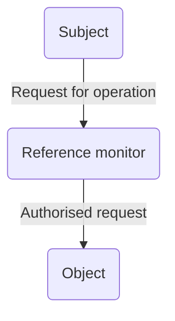
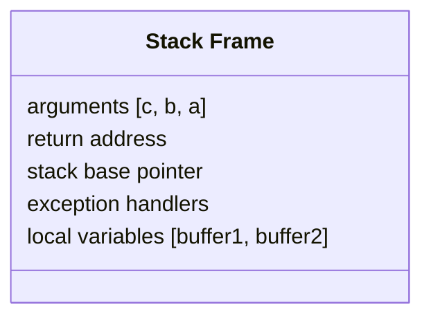

---
tags:
  - uni
  - sem1
---
[[Computer Security|Back to Computer Security Home]]
Also part of [[Revision Home|exam revision]]

This course focuses on the security mechanisms present in the **`x86 Unix`** *operating system*.
# Contents
- [[#Why does an OS need security features?|Why does an OS need security features?]]
- [[#The `Unix` Kernel|The `Unix` Kernel]]
- [[#Process Management|Process Management]]
	- [[#Process Management#`pid`, `uid`, `euid`, & `gid`|`pid`, `uid`, `euid`, & `gid`]]
		- [[#`pid`, `uid`, `euid`, & `gid`#`pid`|`pid`]]
		- [[#`pid`, `uid`, `euid`, & `gid`#`uid`|`uid`]]
		- [[#`pid`, `uid`, `euid`, & `gid`#`gid`|`gid`]]
		- [[#`pid`, `uid`, `euid`, & `gid`#`euid`|`euid`]]
	- [[#Process Management#Inter-Process Communication|Inter-Process Communication]]
- [[#`x86` CPU/Memory|`x86` CPU/Memory]]
	- [[#`x86` CPU/Memory#`x86` process memory layout|`x86` process memory layout]]
	- [[#`x86` CPU/Memory#Virtual memory|Virtual memory]]
		- [[#Virtual memory#`hyberfil.sys` attack|`hyberfil.sys` attack]]
- [[#Privilege separation|Privilege separation]]
	- [[#Privilege separation#Why do we want to separate privileges?|Why do we want to separate privileges?]]
	- [[#Privilege separation#Reference monitor|Reference monitor]]
	- [[#Privilege separation#Permissions|Permissions]]
		- [[#Permissions#File Permissions|File Permissions]]
		- [[#Permissions#Directory permissions|Directory permissions]]
	- [[#Privilege separation#Return to `pids`|Return to `pids`]]
	- [[#Privilege separation#`setuid`|`setuid`]]
- [[#Least privilege|Least privilege]]
- [[#Privilege separation|Privilege separation]]
- [[#Open design|Open design]]
- [[#Fail-safe defaults|Fail-safe defaults]]
- [[#Complete mediation|Complete mediation]]
- [[#Usable security|Usable security]]
- [[#Usability vs. Security|Usability vs. Security]]
- [[#Network Attacks|Network Attacks]]
- [[#Phishing|Phishing]]
	- [[#Phishing#Password Managers|Password Managers]]
- [[#Keyloggers|Keyloggers]]
- [[#Guessing passwords|Guessing passwords]]
	- [[#Guessing passwords#Online guessing passwords|Online guessing passwords]]
	- [[#Guessing passwords#Offline Guessing Attack|Offline Guessing Attack]]
- [[#How a `C` program gets executed|How a `C` program gets executed]]
- [[#`x86-32` registers|`x86-32` registers]]
	- [[#`x86-32` registers#`%eip`|`%eip`]]
	- [[#`x86-32` registers#`%esp`|`%esp`]]
	- [[#`x86-32` registers#`%ebp`|`%ebp`]]
- [[#Stack Frames|Stack Frames]]
- [[#Buffer Overruns|Buffer Overruns]]
	- [[#Buffer Overruns#Control Hijacking|Control Hijacking]]
	- [[#Buffer Overruns#Shellcode injection|Shellcode injection]]
- [[#Canaries|Canaries]]
- [[#Write `XOR` Execute (W^X)|Write `XOR` Execute (W^X)]]
	- [[#Write `XOR` Execute (W^X)#`return-to-libc` attacks|`return-to-libc` attacks]]
		- [[#`return-to-libc` attacks#Address Space Layout Randomisation|Address Space Layout Randomisation]]

# Overview of Unix Features
## Why does an OS need security features?
**Multiple users** - OSes must allow for multiple users with potentially different levels of access on the same computer (e.g. a teacher vs a student). There needs to be in-place mechanisms to *isolate these different users*.

**Multi-tasking** - OSes must allow multiple application programs to run at the same time. There needs to be in-place mechanisms to *isolate different applications running*. ^04bd9c
## The `Unix` Kernel
The kernel is a key component of the operating system. It handles direct interaction with the hardware, and manages secure sharing/access of low-level resources between users and applications. There is a hierarchy of power in a computer system, with the kernel firmly at the top and "*userland*" programs at the bottom.
![[UNIX Kernel layers visualisation.png]]
A computer running `Unix` has two execution modes:
- **Kernel mode** - this gives direct access to hardware resources ^c93aa7
- **User mode** - this only allows the computer to make `syscalls` to the kernel to access the hardware

**System calls**, or `syscalls` are usually contained in a collection of programs (a *library*, such as `libc` for `C`) and provides the interface to interact with the kernel. ^72d448

Since moving into *kernel mode* (or *kernel space*) involves allowing direct interaction with the hardware, an OS has to limit how and when an application can do this to provide security and correctness.
![[UNIX syscall Interface.png]]
To interact with input/output devices, the *application programmer interface* (or *API*) is an interface (much like `syscall`) to allow high-level access to these devices; the OS does the low-level "heavy lifting".
## Process Management
To manage [[#^04bd9c|applications]], `Unix` has something called a *process* - an instance of a currently running program. The contents of the program are stored in *persistent storage* (i.e. a hard drive) but to be executed, it must be loaded into RAM and **uniquely** identified as a process. This also allows multiple copies of the same program to run simultaneously as all are different processes of the same program code. The kernel also has a "*time-slicing*" capability, giving each running process a fair share of the CPU so all running applications can execute. This gives the illusion of simultaneous multitasking as this slice is so small and "context-switching" happens too fast for us to notice.

### `pid`, `uid`, `euid`, & `gid` 
#### `pid`
To uniquely identify a process, each one is given a **unique** *process ID* (`pid`). Each `pid` will have CPU time, memory usage, a user id (`uid`), the program name, etc.
#### `uid`
The *user id* (`uid`) identifies the user associated with this process, e.g. who started the program.
#### `gid`
The *group id* (`gid`) can be used to group a bunch of users and manage privileges for them.
#### `euid`
Similar to a [[#`uid`|uid]], the *effective* user id takes precedence in determining the privileges of the program. This is usually the same as the `uid` of the user who executed the process, but certain designated processes are run with the `euid` set to the application's owner (who may have higher privileges) than the user who runs the process.

### Inter-Process Communication
It is often necessary for processes to communicate with each other, of which there are several methods for.

One method is to pass messages through reading and writing to files. While simple, this method does not result in secure communication.

*Sockets* or *pipes* are essentially tunnels from one process to another. These are stored in RAM the whole time, but through the kernel this process is made fast, efficient, and secure.
## `x86` CPU/Memory
When a program is executed, it is loaded into RAM and uniquely identified. The allocated memory is its *address space*, containing the code for the program, the input data, and the working memory. ^2a9191

The CPU interprets all instructions in a "dumb" way; it does not (*explicitly, this could arguably be inferred but in practise, isn't*) know which process instructions belong to, so it is up to the OS to isolate these instructions from each other using the kernel and address space
### `x86` process memory layout
![[x86 process memory layout.png]]
There are several *registers* on the CPU. The `%eip` will point to the address of the next instruction which gets loaded. The `%esp` (pictured) always points to the top of the stack.
### Virtual memory
Unfortunately, computers usually have a smaller amount of available RAM to store running programs/processes/data than they do *persistent* storage, so virtual memory exists to take advantage of this fact.
![[Virtual Memory.png]]
The program still infers it's [[#^2a9191|address space]] as one *contiguous* slab of memory. In reality, a *memory management unit* (MMU) maps the "logical" address space into the actual physical address space. This allows many more processes/fatter processes to run at the same time with limited memory, but does not come without it's drawbacks. Firstly, the speed of the *persistent* memory used for virtual memory is usually much slower than the RAM, meaning read/write speeds for these processes are immensely bottlenecked. Secondly, on *Windows*, this opens the computer up for an attack.
#### `hyberfil.sys` attack
Windows has 3 `.sys` files important to this attack:
- `pagefile.sys` is what Windows uses to store virtual memory contents
- `hiberfil.sys` is what Windows uses to store volatile memory contents (e.g. RAM) when the system enters *hibernation*
- `swapfile.sys` is what Windows uses to store idle and non-active process data

The attack goes as follows:
1. Attacker, with physical access to the computer, improperly powers it off.
2. Attacker boots to different OS via external media.
3. Attacker retrieves the all 3 `.sys` files.
4. Attack reads these files and gains access to the passwords/sensitive info that were stored in memory

A method of thwarting this attack is through the use of *hard disk encryption* so these files cannot be easily read.
## Privilege separation
### Why do we want to separate privileges?
The goal is to prevent potential misbehaving applications or users from harming the rest of the system. Inside their own scoped privilege sure, but not for everyone else.

Our central question is "**Who** is allowed to access **what**, and **how**?"

**Who** - the user, application, processes ^56b2a4

**What** - protected resources i.e. hardware devices, network sockets, memory, files ^671d97

**How** - reading, writing, executing ^8c5db3
### Reference monitor
All requests for any operations are [[#Complete mediation|mediated]]; they go to a *reference monitor* which has specific access control policies:

The reference monitor grants permission to [[#^56b2a4|users]] to apply certain [[#^8c5db3|operations]] to a given [[#^671d97|resource]].
### Permissions
#### File Permissions
All resources are managed as files, with three defined permissions - *read* (`r`), *write* (`w`), and *execute* (`x`). Permissions are defined for the file's owner, the owner's group, and other users. The owner and `root` (`uid`  of `0` usually) can change the file permission but **only `root`** can change the file *ownership*.
#### Directory permissions
The *execute* (`x`) permission on a directory allows that user to *traverse it*, and the *read* (`r`) permission on a directory allows *lookup*.
### Return to `pids`
We've already covered [[#`uid`|uid]] and [[#`euid`|euid]], but processes also have a *saved* user ID (`suid`)
This is the *effective* user ID before the last modification.

Users can also change a process' IDs using the following functions:
```
					setuid(x)          seteuid(x)
					 uid <- x           uid <- uid
					 euid <- x          euid <- x
					 suid <- x          suid <- suid
```
Only `root` can change `euid`/`uid` to arbitrary values `x` - unprivileged user can only change the `euid` to `uid`/`suid`.
### `setuid`
We can drop privileges on a program that runs as `root`, and we want to fork a process of. The following code will do just this:
```c
if (auth(uid, pwd) == SUCCESS) {
	if (fork() == 0) {
		setuid(uid);
		exec("bin/bash");
	}
}
```

An executable file can also have a `setuid` *enabled*. If this bit is set, the program runs with the `euid` of its owner. For example, if *Alice* executes a `setuid: 1` file owned by *Bob*, the `euid` of the process is *Bob* - not *Alice*.
This can allow for some vulnerabilities - some programs that access system resources (that go [[#^c93aa7|kernel mode]]) are owned by `root` with **`setuid: 1`**.

`UNIX` permissions are sometimes criticised for being *too coarse-grained*. All applications installed by a single user account have the same privileges.
# Security Principles
Many OSes have different defence mechanisms that are *layered* - if one falls, we have a fall-back. ^bf1178
## Least privilege
Users and programs should only access the data and resources required to perform its function.
## Privilege separation
Segment system into components we can limit access to.
## Open design
Security of a mechanism should not depend on its secrecy. The design will always get leaked!
## Fail-safe defaults
Default configuration should be conservative, e.g. new user should be granted least privileges by default.
## Complete mediation
Every access to a resource must be checked for compliance with security policy.
## Usable security
UIs and security mechanisms should be designed with the ordinary user in mind – the users should be supported in interacting in a secure way with the system – you can’t blame users!
# Passwords
Passwords solve the problem of [[Network Security#Confidentiality|authenticating]] users. The typical solution is a username/password combination, where the password is something only the authentic user should be able to know.
## Usability vs. Security
Passwords need to be **hard to guess** and yet **easy to remember**.
## Network Attacks
Eavesdroppers can listen into password sent to servers. To defend this we can encrypt communication using [[Secure Communications#TLS|TLS]]. 
## Phishing
By pretending to be the legitimate company, attackers can get password information and happily log in to sensitive accounts.
### Password Managers
Password managers autofill passwords on legit sites, so if your manager doesn't prompt you to fill the password in, it's likely a phishing site. Many password managers create hard-to-crack passwords too, providing a useful solution to the [[#Usability vs. Security]] problem above.
## Keyloggers
Through the use of malware, keyloggers can learn your password as you physically type it. Using [[Network Security#^417696|2 Factor Authentication]] is one method of stopping this - although it does not protect the password being revealed, merely the signing in process - a *[[#^bf1178|layered]]* defence.
## Guessing passwords
There are two methods attackers use to guess passwords
### Online guessing passwords
The username of the usr/pwd combo is usually not hard to guess, or even a secret at all. For example, on *Twitter*, Elon Musk's username is `@elonmusk` - this is public information.

This attack involves trying multiple passwords from a *dictionary* with this username to log in. Dictionaries can be any random strings, common passwords, or obtained from the compromised servers in an [[#Offline Guessing Attack]].

These can be prevented by simply choosing a good password, Captchas, or by rate limiting attempts to make this attack take an inconvenient amount of time.
### Offline Guessing Attack
These attacks target the server. It must store all passwords, so the aim is to somehow get a copy of these off the server.

A protection would be to [[Cryptography#Cryptographic Hash Functions|hash]] the passwords, but due to common password tropes, these could be easily matched to the plaintext through [[Cryptography#^71a98c|frequency analysis]]. By *salting* these hashes with a known value (*i.e. a randomly generated user ID*), this produces a different hash for each user. Even if all users on a system used `Password123!!`, if salted & hashed (which sounds like something you'd do to potatoes), the attacker has no feasible way of knowing
# Memory Management
## How a `C` program gets executed
1. The *compiler* converts `C` code to assembly code
2. The *assembler* converts assembly code to machine code
3. The *linker* handles dependencies and libraries
4. The *loader* sets up address space in memory and loads machine code, then ju,ps to the first instruction of the program
5. The *CPU* interprets instructions
## `x86-32` registers
`UNIX` has many *temporary* registers such as `%eax, %ebx, %ecx, %edx, %edi,` and  `%esi`. Most important for us are:
### `%eip`
The `%eip` points to the next instruction. It gets incremented after each instruction but can be modified by instructions such as `call`, `ret`, `jmp`, and the conditional variants of `jmp`
### `%esp`
Points to the top of the stack at all times
### `%ebp`
Points to the base of the stack [[#Stack Frame|frame]] of the current function call
## Stack Frames
For the following `C` code,
```c
void function(int a, int b, int c) {
	char buffer1[5];
	char buffer2[10];
}
void main() {
	function(1,2,3);
}
```
We would produce the following `Assembly` code:
```asm
fun: pushl %ebp
	 movl %esp,%ebp
	 subl $20,%esp
main: pushl $3
	  pushl $2
	  pushl $1
	  call fun      <---- %eip
```
and this would be the stack frame at this address. A stack frame contains information about the current state of the program in memory.

When a function is called, the old *frame pointer* ([[#`%eip`|%eip]]) is pushed onto the stack, and the `%eip` is set to the [[#`%esp`|%esp]], where the end of the stack currently is right now. Then, any needed local variables are pushed onto the stack.

When returning to the previous function, 
- we reset the previous stack frame
	- `%esp` = `%ebp`, `%ebp` = (`%ebp` *from the stack*)
- we jump back to the return address
	- `%eip` = `4(%ebp)`
# Attacks on memory
## Buffer Overruns
Many commands in `C` (such as `gets`) are unsafe. These can be exploited to write to memory outside of the buffer's defined limits, and potentially into other elements of the stack, such as local variables.

Consider a program where a password is read from a file the user cannot read (but the program can read). If we know where in memory this local variable is stored, we can manipulate an input to an `entered_pwd` buffer so when checking, the two values checked are identical (as we have *overwritten* the stored password).
### Control Hijacking
Another usage of buffer overruns is *control hijacking*. This involves using an overrun to load malicious code into memory and also getting overwriting the `%eip` so to point to it.

This can be tricky to find where to properly insert our code and set the correct address to the `%eip`, so a common technique is to use a **`NOP` sled**. This involves inserting many `NOP` commands before the actual code, and getting the `%eip` to point *somewhere* in this. This makes it "slide" down into the actual code to execute.
![[NOP sled.png]]
### Shellcode injection
A common implementation of [[#Control Hijacking]] is *shellcode injection*. This aims to spawn a shell with the highest privileges possible. For example, the following `C` code:
```c
#include stdio.h
void main() {
	char *name[2];
	name[0] = "/bin/sh";
	name[1] = NULL;
	execve(name[0], name, NULL);
}
```
can be translated into the following machine code:
```machine-code
“\x31\xc0”
“\x50”
“\x68” “//sh”
“\x68” “/bin”
“\x89\xe3”
“\x50”
```
which if inserted and executed, spawns a shell. The code cannot contain any *zero bytes* (`printf, gets, strcpy` stop execution on a *zero* byte).
# Protections against memory attacks
## Canaries
Canaries aim to solve the issue of `return` addresses being rewritten by inserting *random* values before the stack return pointer. If the return value is overwritten, these canaries are (likely) overwritten to and this can be checked.

Canaries should always be random and fresh for each process (execution of the program) otherwise [[#Buffer Overruns]] can predict them, rendering them useless. It is also assumed the attacker cannot "jump over" the canary and must write a continuous stretch of data to the stack return pointer - if this is not the case, canaries provide little protection. Canaries are also stack-based and can not handle heap overruns.
## Write `XOR` Execute (W^X)
`W^X` makes regions in memory *either* executable *or* writeable - but not both!
The stack & heap will be writable and not executable as they only store data. This means, even if a BO can occur, the program can only be written to the stack - not executed from it.
### `return-to-libc` attacks
A counter-attack to this defence utilises the fact the [[#^72d448|libc]] library is usually linked to most `C` programs. This library contains useful `syscalls` such as `exec()` - which executes the argument. If an attacker can find the location of `exec()`, make a valid stack from for a call to it, and pass it `"/bin/sh"` as an argument, he can [[#Shellcode injection|spawn a shell]].
#### Address Space Layout Randomisation
ASLR is a counter-defence to this counter-attack by changing the address space of certain functions (such as those in `libc`) at runtime for each process. This at least means the attacker cannot create a reliable `return-to-libc` attack.