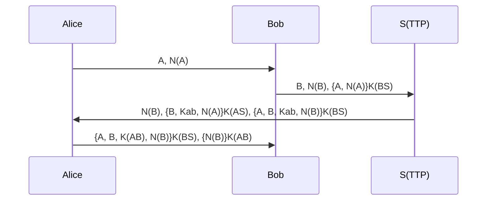
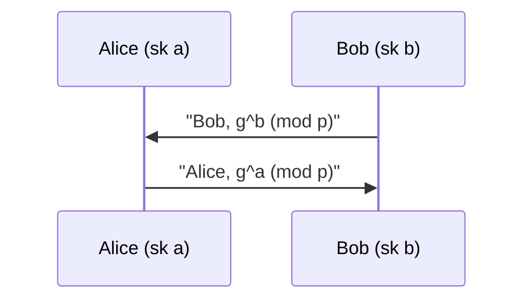
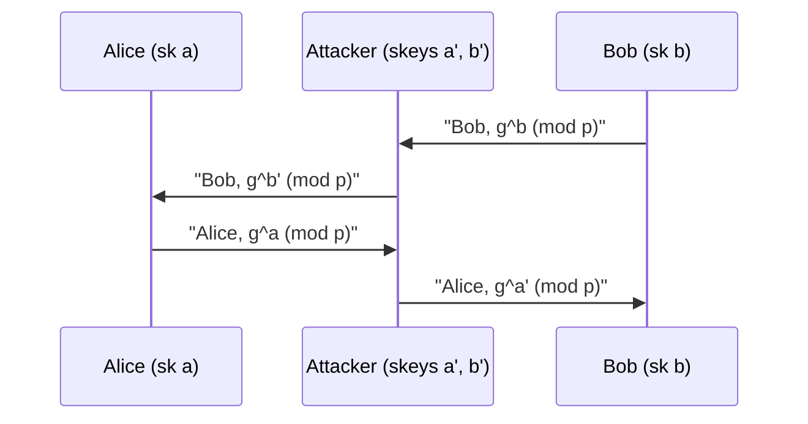
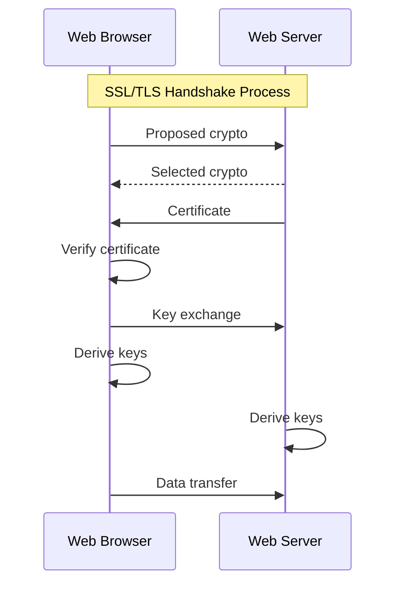
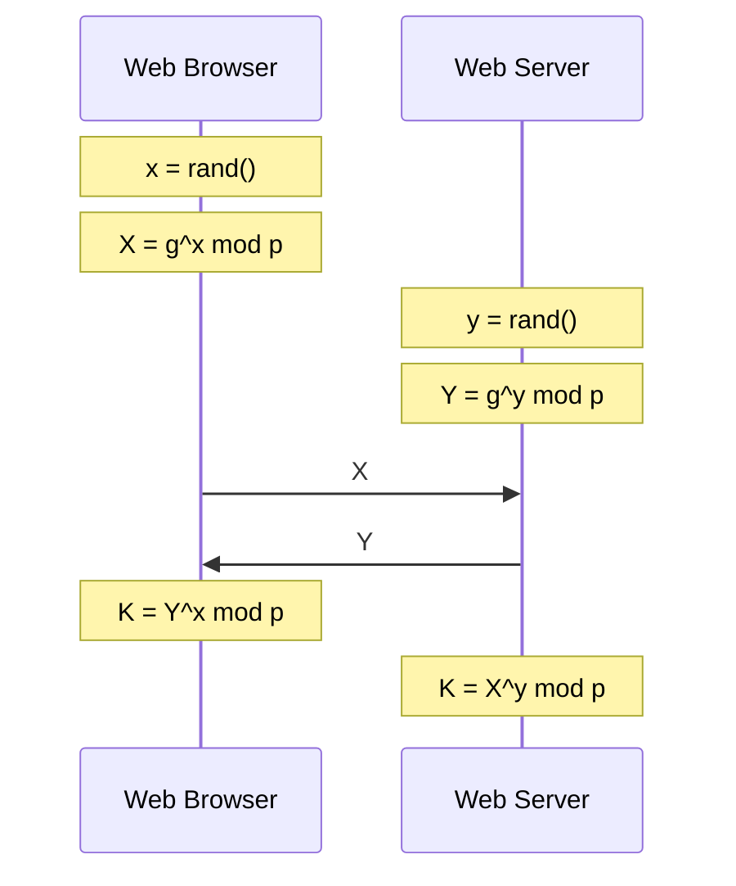
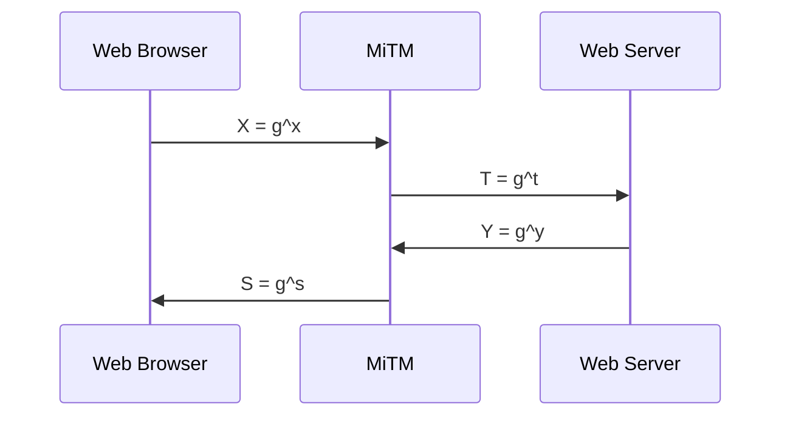
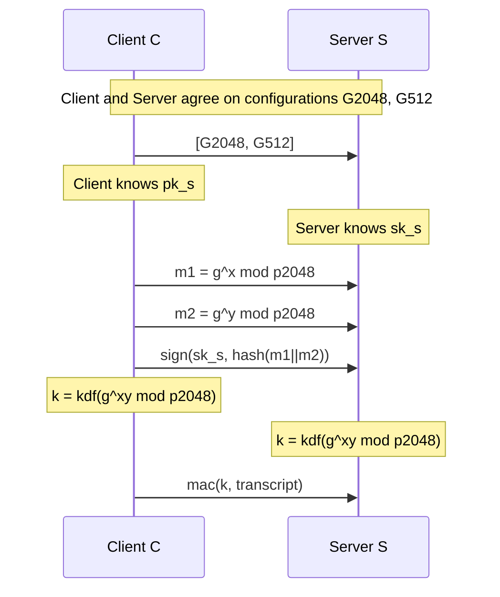
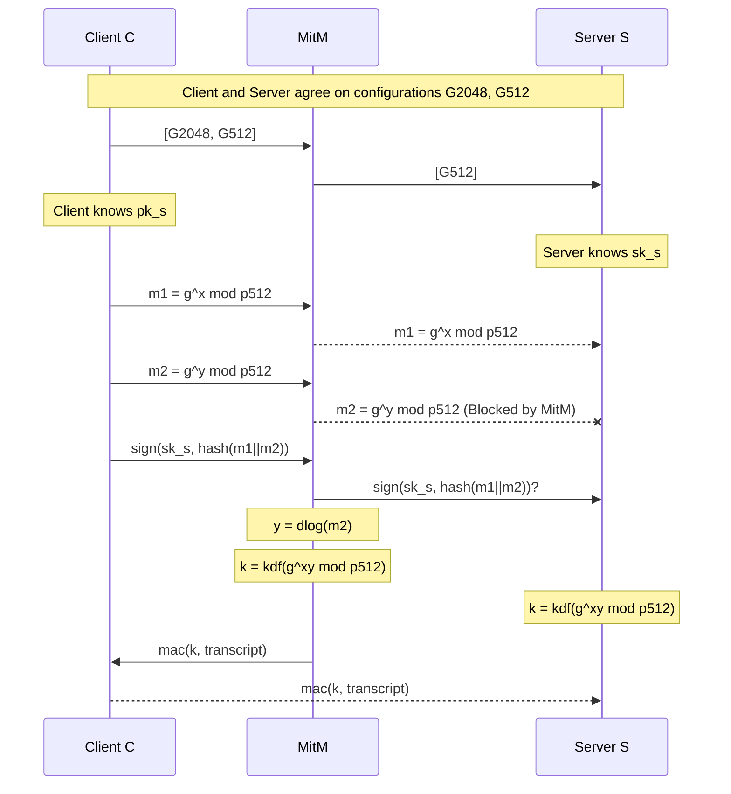

---
tags:
  - uni
  - sem1
---

[[Computer Security|Back to Computer Security Home]]
Also part of [[Revision Home|exam revision]]
# Contents
- [[#Example using *Yahalom* protocol|Example using *Yahalom* protocol]]
- [[#Negatives of TTP|Negatives of TTP]]
- [[#Evil Necessary Number Theory|Evil Necessary Number Theory]]
	- [[#Evil Necessary Number Theory#Relative primes and $\phi(n)$|Relative primes and $\phi(n)$]]
	- [[#Evil Necessary Number Theory#$\mathbb{Z}_{n}$|$\mathbb{Z}_{n}$]]
		- [[#$\mathbb{Z}_{n}$#Modular inversion|Modular inversion]]
	- [[#Evil Necessary Number Theory#$\mathbb{Z}^{*}_{n}$|$\mathbb{Z}^{*}_{n}$]]
		- [[#$\mathbb{Z}^{*}_{n}$#Euler's Theorems|Euler's Theorems]]
- [[#Intractable Problems|Intractable Problems]]
	- [[#Intractable Problems#Factoring|Factoring]]
	- [[#Intractable Problems#RSAP|RSAP]]
	- [[#Intractable Problems#Discrete Log|Discrete Log]]
- [[#Diffie-Hellman Protocol|Diffie-Hellman Protocol]]
	- [[#Diffie-Hellman Protocol#MiTM attack on Diffie-Hellman|MiTM attack on Diffie-Hellman]]
- [[#RSA Trapdoor Permutation|RSA Trapdoor Permutation]]
	- [[#RSA Trapdoor Permutation#Raw RSA|Raw RSA]]
		- [[#Raw RSA#PKCS1 v2.0: *RSA*-OAEP|PKCS1 v2.0: *RSA*-OAEP]]
- [[#ElGamal (EG)|ElGamal (EG)]]
- [[#Building MACs using block ciphers|Building MACs using block ciphers]]
	- [[#Building MACs using block ciphers#ECBC-MAC|ECBC-MAC]]
	- [[#Building MACs using block ciphers#PMAC|PMAC]]
	- [[#Building MACs using block ciphers#HMAC|HMAC]]
- [[#Authenticated Encryption|Authenticated Encryption]]
- [[#Advantages over [[#Message Authentication Codes|MAC]]|Advantages over [[#Message Authentication Codes|MAC]]]]
- [[#Textbook RSA Signatures|Textbook RSA Signatures]]
- [[#Public Key Distribution methods|Public Key Distribution methods]]
	- [[#Public Key Distribution methods#Public Announcements|Public Announcements]]
	- [[#Public Key Distribution methods#Publicly available directories|Publicly available directories]]
	- [[#Public Key Distribution methods#Public-key authority|Public-key authority]]
- [[#X.509 certificates|X.509 certificates]]
- [[#Revoking Certificates|Revoking Certificates]]
- [[#Goals of TLS|Goals of TLS]]
- [[#TLS Building Blocks|TLS Building Blocks]]
- [[#TLS Overview|TLS Overview]]
	- [[#TLS Overview#Basic Key Exchange|Basic Key Exchange]]
		- [[#Basic Key Exchange#Forward Secrecy|Forward Secrecy]]
	- [[#TLS Overview#Diffie-Hellman Key Exchange|Diffie-Hellman Key Exchange]]
	- [[#TLS Overview#Signed DH key exchange|Signed DH key exchange]]
			- [[#Forward Secrecy#LOGJAM|LOGJAM]]
- [[#Three-party dining cryptographers|Three-party dining cryptographers]]
	- [[#Three-party dining cryptographers#Premise|Premise]]
	- [[#Three-party dining cryptographers#3DC Protocol|3DC Protocol]]
		- [[#3DC Protocol#Phase 1|Phase 1]]
		- [[#3DC Protocol#Phase 2|Phase 2]]
		- [[#3DC Protocol#Phase 3|Phase 3]]
	- [[#Three-party dining cryptographers#nDC|nDC]]
- [[#Crowds|Crowds]]
- [[#Chaum's Mix|Chaum's Mix]]
- [[#TOR Relay|TOR Relay]]
- [[#Attacks on TOR|Attacks on TOR]]
	- [[#Attacks on TOR#End-to-End Correlation|End-to-End Correlation]]
	- [[#Attacks on TOR#Selective DOS|Selective DOS]]
- [[#Website fingerprinting|Website fingerprinting]]

# Asymmetric Encryption Primer
The concept of asymmetric encryption comes from several users wanting to communicate securely with the same <i><b>shared</b> secret key</i>. In cases like Google for example, it would be unrealistic for them to create and keep a secure secret key for all users
# Online Trusted Third Party
An **Online TTP** is a [[Network Security#Trust|trusted]] third party entity that hosts secret keys for Users.
## Example using *Yahalom* protocol
Say we have users $U_{1}, U_{2}, U_{3}, \dots, U_{n}, \dots$
Each user $U_{i}$ has a shared secret key $K_{i}$ with the TTP.
Users $U_{i}$ and $U_{j}$ can establish a key $K_{ij}$ with the help of the TTP.

Let's break this down message-by-message:
0. Before any messages start: 
	- *Alice* has **secret key** $k_{AS}$
	- *Bob* has **secret key** $k_{BS}$
	- *The Trusted Third Party Server **S(TTP)*** has *Alice* and *Bob's* **secret keys** $k_{AS}, k_{BS}$
1. *Alice* sends $A, N_{A}$ to *Bob*
	 - *Alice* sends her identifier, $A$, and her *nonce* $N_{A}$. A *nonce* is a randomly generated number, used to *salt* messages. Mainly to prevent *replay* attacks on [[Cryptography#Cryptographic Hash Functions|hash functions]].
2. *Bob* sends $B, N_{B}, (A, N_{A})k_{BS}$ to the *TTP*
	- *Bob* sends:
		- His identifier, $B$
		- His nonce, $N_{B}$, generated upon receiving *Alice's* message
		- The message ($A, N_{A}$) (*Alice's previous message*) encrypted under *Bob's* secret key $k_{BS}$
3. *TTP* sends $N_{B}, (B, k_{AB}, N_{A})k_{AS}, (A, B, k_{AB}, N_{B})k_{BS}$ to *Alice*
	- *TTP* sends:
		- *Bob's* nonce, $N_{B}$
		- The message ($B, k_{AB}, N_{A}$) encrypted under *Alice's* secret key $k_{AS}$
			- *Bob's* identifier, $B$
			- The *TTP's* **shared** secret key (also called session key), $k_{AB}$
			- *Alice's* nonce, $A$
			- **Note**: Alice *can* decrypt this message (it's her secret key)
		- The message ($A, B, k_{AB}, N_{B}$) encrypted under *Bob's* secret key $k_{BS}$
			- *Alice's* identifier, $A$
			- *Bob's* identifier, $B$
			- The *TTP's* shared secret key, $k_{AB}$
			- *Bob's* nonce, $B$
			- **Note**: Alice *cannot* decrypt this message (it's *Bob's* secret key)
				- This message is really for *Alice* to send back onto *Bob*
1. *Alice* sends $(A, B, k_{AB}, N_{B})k_{BS}, (N_{B})k_{AB}$ send to *Bob*
	- *Alice* sends:
		- The message $(A, B, k_{AB}, N_{B})$ encrypted under *Bob's* secret key $k_{BS}$
			- *Alice's* identifier, $A$
			- *Bob's* identifier, $B$
			- The *TTP's* shared secret key, $k_{AB}$
			- *Bob's* nonce, $B$
			- **Note**: this is the non-decryptable message the *TTP* sent Alice before
		- *Bob's* nonce, $N_{B}$, encrypted under the *shared* secret key, $k_{AB}$
			- This is sent as a confirmation message
			- Bob now knows both parties have the shared secret key, and can encrypt and decrypt messages with it
## Negatives of TTP
This relies on trust within the *TTP* to generate secure keys and not to leak info that can be used to crack these keys. Under the above protocol, even if the messages weren't further encrypted, all an attacker could learn is Bob and Alice are talking, their nonces, and a bunch of encrypted rubbish useless without knowing the secret keys used. Even with one key leaked, the entire secure communications (*namedrop 😎*) process could be compromised.
# Public Key Encryption
The idea of public-key encryption is that each user has two keys - a *public key* and a *private key*. The private key is similar to secret keys in the above example, but the difference is the *public key* is **known to everyone**. Public Key Encryption means we can establish a shared secret key without a [[#Online Trusted Third Party|TTP]]!

If we define a key generation algorithm $G: \rightarrow \mathcal{K} \times \mathcal{K}$,

and an encryption algorithm $E: \mathcal{K} \times \mathcal{M} \rightarrow \mathcal{C}$,
	(when ***public*** **key** applied to **message**, produces **ciphertext**)
	
and a decryption algorithm $D: \mathcal{K} \times \mathcal{C} \rightarrow \mathcal{M}$,
	(when ***private*** **key** applied to **ciphertext**, produces **message**)

$\forall(sk, pk) \in G$, and $\forall{m} \in \mathcal{M}$, $D(sk, E(pk, m)) = m$ 
<u>Translation</u>
For all *secret keys* ($sk$) and *public keys* ($pk$) that can be generated by $G$,
(noting these keys should be generated as a *pair*, not just any random combo)

and for all *messages* ($m$) in the possible *message space* ($\mathcal{M}$),
(example $\mathcal{M}$: "english sentences under 15 words")

If we put $m$ and $pk$ into the *encryption* algorithm $E$, and put the result of that into the *decryption* algorithm $D$, alongside the corresponding *secret key* $sk$, we will get $m$ in plaintext back out.

It is important $sk_{Bob} \neq pk_{Bob}$!
## Evil Necessary Number Theory
### Relative primes and $\phi(n)$
$a$ and $b$ in $\mathbb{Z}$ are **relative primes** if they have no common factors. The *Euler* function $\phi(n)$ is the **number of elements that are relative primes** with $n$.$$\phi(n) = |(m |0 < m < n \text{ and gcd}(m, n) = 1)|$$
For a prime $p$, $\phi(p) = p-1$.
For primes $p$ and $q$, $\phi(p \cdot q) = (p-1)(q-1)$
### $\mathbb{Z}_{n}$
If we define $n \in \mathbb{N}$, we can define $\mathbb{Z}_{n} = \{0, \dots, n-1\}$. Then, 
$\forall{a} \in \mathbb{Z}, \forall{b} \in \mathbb{Z}_{n}, a \equiv b (\text{mod } n) \iff \exists{k} \in \mathbb{N}. a = b + k \cdot n$
<u>Translation</u>
- $n \in \mathbb{N}$
	- For any natural number $n$
- $\mathbb{Z}_{n} = \{0, \dots, n-1\}$
	- The set of integers *modulo n*, or in English, the set of all possible *remainders* when you divide any integer (from $\mathbb{Z}$) by $n$.
- $\forall{a} \in \mathbb{Z}, \forall{b} \in \mathbb{Z}_{n},$
	- For all integers $a$ (from $\mathbb{Z}$). and all integers (from $\mathbb{Z}_n$ this time) $b$,
- $a \equiv b (\text{mod } n)$
	- $a$ has the same *remainder* as $b$ when dividing by $n$ ($a$ is *congruent modulo* to $b$)
- $\iff$
	- IF AND ONLY IF
- $\exists{k} \in \mathbb{N}.$
	- There is a natural number $k$ that exists such that...
- $a = b + k \cdot n$
	- $a$ is equal to $b$ plus $k$ lots of $n$

#### Modular inversion
The *inverse* of $x \in \mathbb{Z}_{n}$ is $y \in \mathbb{Z}_{n}$ such that $x \cdot y \equiv 1 (\text{mod } n)$.
We refer to this inverse as $x^{-1}$.

**Formal Theorem**:
*Let $n \in \mathbb{N}$. Let $x \in \mathbb{Z}_{n}$. $x$ has an inverse ($x^{-1}$) in $Z_{n}$ if and only if gcd($x, n$) = $1$*
### $\mathbb{Z}^{*}_{n}$
We define $\mathbb{Z}^{*}_{n} =\{x \in \mathbb{Z}_{n}|\text{ gcd}(x, n)=1\}$
(For example, $Z_{12} = \{1,5,7,11\}$)

We can also see that $|\mathbb{Z}^{*}_{n}| = \phi(n)$

#### Euler's Theorems
$\forall{n} \in \mathbb{N}, \forall{x} \in \mathbb{Z}^{*}_{n} \text{ if } \text{gcd}(x, n) = 1 \text{ then } x^{\phi(n)} \equiv 1 (\text{ mod }n)$ 

For all integers $n$, and all elements of $\mathbb{Z}^{*}_{n}$ (which we'll call $x$), if the greatest common factor between $x$ and $n$ is 1 - if they're coprime and share no other common factors - then $x$ to the power of the size of $\mathbb{Z}^{*}_{n}$ divided by $n$ gives a remainder of 1.
## Intractable Problems
Intractable problems are problems for which there is no known polynomial time algorithm that solves them. They can be brute forced, but this is unreliable. We can build cryptographic schemes off these problems. Some intractable problems are:
- [[#Factoring]]
- [[#RSAP]]
- [[#Discrete Log]]
- [[#Diffie-Hellman Protocol]]
### Factoring
- **Input**: $n \in \mathbb{N}$
- **Output**: $p_{1}, p_{2}, \dots, p_{m}$ primes *such that* $n = p_{1} \cdot p_{2} \cdot \dots \cdot p_{m}$
### RSAP
- **Inputs**:
	- $n$ *such that* $n = p \cdot q$ with $2 \leq p, q$ primes
	- $e$ *such that* $\text{gcd}(e, \phi(n)) = 1$
	- $m^{e}\text{ mod }n$
- **Output**: $m$
### Discrete Log
- **Input**: prime $p$, generator $g$ of $\mathbb{Z}^{*}_{p}$, $y \in \mathbb{Z}^{*}_{p}$
- **Output**: $x$ *such that* $y$ = $g^{x} \text{ (mod }p)$
## Diffie-Hellman Protocol
DHP is very hard in $\mathbb{Z}^{*}_{n}$ [[#$ mathbb{Z} {*}_{n}$|(link)]] 
We fix a very large prime $p$, and a generator $g$ of $\mathbb{Z}^{*}_{n}$, and do the following

Both *secret keys* $a$ and $b$ are computed by picking a number randomly from $g$
$(a \overset{\mbox{r}}{\longleftarrow} \{1, \dots, p-1\}, b \overset{\mbox{r}}{\longleftarrow} \{1, \dots, p-1\})$
The *public keys* in this are $g^{a}$ and $g^{b}$. The *shared private key* $K_{AB}$ (session key) is $g^{ab} \text{ ( mod } p)$, which can be computed either $(g^{b})^{a} \text{ ( mod } p)$ for *Alice*, who knows $a$, or as $(g^{a})^{b} \text{ ( mod } p)$  for *Bob*, who knows $b$. The beauty of DHP is this private key is never sent over messages, and is computed at runtime for each message.
### MiTM attack on Diffie-Hellman
DHP is vulnerable to a Man-in-The-Middle attack. It works by the attacker [[Network Security#Tampering (Active)|tampering]] with the (encrypted) communications to force their own *private keys* into the exchange, meaning they can encrypt and decrypt messages to *Alice* and *Bob*. This results in both parties independently using a *different* "shared" secret key, so the attacker must remember to switch if he is to impersonate the other party.

## RSA Trapdoor Permutation

- $G_{RSA}() = (pk, sk)$ where $pk = (N, e)$ and $sk = (N, d)$  
and $N = p \cdot q$ with $p, q$ random primes  
and $e, d \in \mathbb{Z}$ *such that*. $e \cdot d \equiv 1 \mod \phi(N)$

- $M = C \in \mathbb{Z}_N$

- $RSA(pk, x) = x^e \mod N$ where $pk = (N, e)$

- $RSA^{-1}(sk, x) = x^d \mod N$ where $sk = (N, d)$

- Consistency: $\forall (pk, sk) = G_{RSA}(), \forall x, RSA^{-1}(sk, RSA(pk, x)) = x$  
Proof: Let $pk = (N, e)$, $sk = (N, d)$. and $x \in \mathbb{Z}_N$. Easy case where $x$ and $N$ are relatively prime

$$ \begin{aligned} RSA^{-1}(sk, RSA(pk, x)) &= (x^e)^d \mod N \\ &= x^{ed} \mod N \\ &= x^{1+k\phi(N)} \mod N & \text{(for some integer $k$)} \\ &= x \cdot x^{k\phi(N)} \mod N \\ &= x \cdot (x^{\phi(N)})^k \mod N \\ &= x \mod N &
\end{aligned} $$
(by Euler's theorem, since $x$ and $N$ are relatively prime)
### Raw RSA
[[Cryptography#RSA|RSA]] is deterministic! It is not secure against [[Cryptography#*Chosen-plaintext attack*|chosen plaintext attacks]]. Additionally, if we have an "idea" on what the message "is", we can easily tweak a few numbers to get slightly different outcomes to analyse.

By using [[#RSA Trapdoor Permutation|Trapdoor RSA]], we can build a [[Cryptography#*Chosen-plaintext attack*|Chosen Plaintext Attack (CPA)]] resistant asymmetric cipher using ($G_{RSA}, RSA, RSA^{-1}$)

Let $(E_S, D_S)$ be a symmetric encryption scheme over $(\mathcal{M}, \mathcal{C}, \mathcal{K})$
Let $H : \mathbb{Z}_N^* \rightarrow \mathcal{K}$

Build $(G_{RSA}, E_{RSA}, D_{RSA})$ as follows
- $G_{RSA}()$ as described above 
- $E_{RSA}(pk, m):$ 
	- pick random $x \in \mathbb{Z}_N^*$ 
	- $y \leftarrow RSA(pk, x) = x^e \mod N$ 
	- $k \leftarrow H(x)$ - $E_{RSA}(pk, m) = y \| E_S(k, m)$ 
	- $D_{RSA}(sk, y \| c) = D_S(H(RSA^{-1}(sk, y)), c)$
#### PKCS1 v2.0: *RSA*-OAEP
![[PKCS1 v2 RSA-OAEP.png]]
## ElGamal (EG)
- Fix prime $p$, and generator $g \in \mathbb{Z}_p^*$

- $\mathcal{M} = \{0, \ldots, p-1\}$ and $\mathcal{C} = \mathcal{M} \times \mathcal{M}$

- $G_{EG}() = (pk, sk)$ where $pk = g^d \mod p$ and $sk = d$  
and $d \leftarrow \{1, \ldots, p-2\}$

- $E_{EG}(pk, x) = (g^r \mod p, m \cdot (g^d)^r \mod p)$ where $pk = g^d \mod p$  
and $r \leftarrow \mathbb{Z}$

- $D_{EG}(sk, x) = e^{d^{-1}} \cdot c \mod p$ where $x = (e, c)$

- Consistency: $\forall(pk, sk) = G_{EG}(), \forall x, D_{EG}(sk, E_{EG}(pk, x)) = x$  
Proof: Let $pk = g^d \mod p$ and $sk = d$
  $$
  \begin{aligned}
  D_{EG}(sk, E_{EG}(pk, x)) &= (g^r)^{d^{-1}} \cdot m \cdot (g^d)^r \mod p \\
  &= m \mod p
  \end{aligned}
  $$
# Message Authentication Codes
In larger applications, we don't just need [[Network Security#Confidentiality|confidentiality]] of messages, but also *message [[Network Security#Integrity|integrity]]*. Message authentication codes aim to ensure a message is actually coming from who it says it is - again, using *secret keys*.

Formally, a **MAC** is a pair of algorithms $S, V$ *(sign, verify)* defined over $\mathcal{K}, \mathcal{M}, \mathcal{T}$ *(key-space, message-space, "tag-space")*
- $S: \mathcal{K} \times \mathcal{M} \rightarrow \mathcal{T}$
- $V: \mathcal{K} \times \mathcal{M} \times \mathcal{T} \rightarrow \{\top, \bot\}$
- Consistency: $V(k, m, S(k, m)) = \top$

The message is *unforgeable* as long as $k$ is not known to an attacker.
## Building MACs using block ciphers
We can draw parallels between $S(k, m)$ and $E(k, m)$
$$
\begin{aligned}
V(k, m, t) &= \text{if } m = D(k, t) \\
&= \text{then return True} \\
&= \text{else return False}
\end{aligned}
$$
The problem is block ciphers can usually only process either 128 or 256 bit
### ECBC-MAC
A form of [[Cryptography#Cipher-Block Chaining (CBC) Mode|CBC mode]] but the final message is encrypted with a different key $k_2$.
![[ECBC-MAC.png]]
### PMAC
![[PMAC.png]]
### HMAC
A MAC built from cryptographic hash functions $$\text{HMAC}(k,m)=H(k\oplus OP||H(k\oplus IP||m))$$ where $IP$ and $OP$ are publicly known padding constants. Examples of HMAC are `SSL`, `IPsec`, and `SSH`.
![[HMAC.png]]
## Authenticated Encryption
We aim to *simultaneously* provide [[Network Security#Confidentiality|confidentiality]], [[Network Security#Integrity|integrity]], and authenticity. We do this by combining decryption with integrity verification in one step by computing the MAC on the ciphertext.
# Digital Signatures
The goal of digital signatures are to ensure verifiability.
## Advantages over MAC
- Signatures are *publically verifiable* - in a MAC setting, only Bob can verify Alice's signature
- They are transferable
- They provide *non-repudiation* - Alice cannot later claim she never signed a document with her secret key if the signature has been generated, as only she can sign it
## Textbook RSA Signatures
- $G_{RSA}() = (pk, sk)$ where $pk = (N, e)$ and $sk = (N, d)$  
and $N = p \cdot q$ with $p, q$ random primes  
and $e, d \in \mathbb{Z}$ st. $e \cdot d \equiv 1 \mod \phi(N)$

- $\mathcal{M} = \mathcal{C} = \mathbb{Z}_N$

- Signing: $S_{RSA}(sk, x) = (x, x^d \mod N)$ where $pk = (N, e)$

- Verifying: $$V_{RSA}(pk, m, x) =\begin{cases}
    \text{T} & \text{if } m = x^e \mod N \\
    \bot & \text{otherwise}
    \end{cases}$$ where $sk = (N, d)$

- *such that* $\forall(pk, sk) = G_{RSA}(), \forall x, V_{RSA}(pk, x, S_{RSA}(sk, x)) = \text{T}$  
Proof: exactly as proof of consistency of RSA encryption/decryption

The problem with textbook RSA signatures are that they do not provide *existential inforgeability*.
Suppose *Eve* has two valid signatures ${\sigma}_{1} = M^{d}_{1} \mod n$ and ${\sigma}_{2} = M^{d}_{2} \mod n$ from *Bob* on messages $M_{1}$ and $M_{2}$.
Eve can produce a new valid signature for *Bob* on the message $M_{1} \cdot M_{2}$ by multiplying the two signatures together.

To prevent this, hash the messages *before* signing them. Hashing afterwards would allow *Eve* to just hash the 2 hashed signatures to forge this message.
# Public Key Authenticity
How can we be sure someone's public key is *authentic*?
## Public Key Distribution methods
### Public Announcements
"Participants should just broadcast their public key".
These broadcasts could easily be forged without authenticity (which public keys are needed for!)
### Publicly available directories
"Participants publish public key on public directories"
Same problem as above
### Public-key authority
Similar to a [[#Online Trusted Third Party|TTP]] but for public keys. "Participants contact authority for each public key needed"
As long as the authority is trusted, this only has the issue of a major bottleneck on the authority(ies).

correct answer is $\downarrow$ 
# Certificates
A certificate consists of a ***public key***, a ***subject*** identifying the key's *owner*, ***signature*** by the *certificate authority* on the key and subject binding them together.
Same trust issue as [[#Public-key authority]] but avoids the bottleneck.
## X.509 certificates
![[X509 certificate format.png]]
X.509 is a standard used in many applications such as TLS. There are multiple levels of *certificate authorities*, all signing down, from a *root* certificate. Self-signed certificates are subject to MiTM attacks.
## Revoking Certificates
If a *private key* has been *compromised*, the corresponding certificate needs to be revoked. X.509 adopts the ***Certificate Revocation List***, a list of known revoked certificates. The modern solution is ***Online Certificate Status Protocol*** - where the client will contact the server to check that the *certificate (/authority)* has not been revoked.

CA's can outsource the signing of certificates to other parties, which is why revocation is needed. This is also why the "chain of trust" exists, as if you revoke a CA, all the ones beneath them are revoked and will need to resign certificates.
# SSL
See [[#TLS]]. SSL was substituted by it in 1999. I don't think there's any examinable content on SSL specifically.
# TLS
## Goals of TLS
- End-to-End Confidentiality
	- Encrypt communication between client and server applications
- End-to-End Integrity 
	- Detect corruption of communication between client and server applications
- Required server authentication
	- Identity of server always proved to client
- Optional client authentication
	- Identity of client optionally proved to server •
- Modular deployment
	- Intermediate layer between application and transport layers
	- Handles encryption, integrity, and authentication on behalf of client and server applications#
## TLS Building Blocks

|                   | Confidentiality                              | Integrity                                 | Authentication                           |
| ----------------- | -------------------------------------------- | ----------------------------------------- | ---------------------------------------- |
| Setup             | Public-key based key-exchange (RSA and DH)   | Public-key digital signature (e.g., RSA)  | Public-key digital signature (e.g., RSA) |
| Data transmission | Symmetric encryption (e.g., AES in CBC mode) | Hash-based MACs (e.g., HMAC using SHA256) |                                          |
## TLS Overview

The browser sends the crypto algorithms it supports, and the server chooses the best one that it also supports and sends this back. It then sends back it's certificate, which the client verifies.
The client and the server, through a [[#Basic Key Exchange]], agree on a value $R$ to exchange messages with.
### Basic Key Exchange
Sometimes called the *RSA key exchange* for historical reasons, the client generates a random secret value $R$. It encrypts $R$ using the server's *public key* and sends across $C = E_{PK}(R)$, which the server decrypts to get the value of $R=D_{SK}(C)$.
#### Forward Secrecy
If the *secret key* $SK$ gets compromised, all past messages can be decrypted, which is bad. To achieve forward secrecy, we use the [[#Diffie-Hellman Protocol|Diffie-Hellman]] [[#Diffie-Hellman Key Exchange|Key Exchange]].
### Diffie-Hellman Key Exchange
The public parameters are a prime $p$ and generator $g$ of $\mathbb{Z}_{p}$. The client generates random $x$ and computes $X = g^{x}\mod p$, and the $Y = g^{y}\mod p$. Sending these between each other, they can both compute $K = g^{xy}\mod p$. 

This is unfortunately subject to a MiTM attack through use of their own two keys $t$ and $s$.

The *web browser* thinks $K_{(1)} = g^{xs}$ and *server* thinks $K_{(2)} = g^{yt}$ - the MiTM knows these both and so can encrypt/decrypt communication. This can be solved with a [[#Signed DH key exchange]]
### Signed DH key exchange

##### LOGJAM
By a MiTM downgrading the communication's security protocol, they can brute force the encryption.

# Anonymous communication
So far, we've had ways to ensure messages are coming from a known person, and can't be read. Now, we will look over methods to ensure communications *cannot* be traced to their origin. Such methods include:
- [[#Three-party Dining Cryptographers|3DC]]
- [[#Crowds]]
- [[#Chaum Mixing]]
- [[#Onion Routing]]
## Three-party dining cryptographers
### Premise
Three **NSA** cryptographers are having dinner.
At the end of the dinner, they are informed it has already been paid for.
They know either the *NSA paid for dinner*, or *one of the cryptographers paid*.
To find out if the NSA paid or not (while not revealing *which cryptographer paid*), we can follow the <u><b>3DC Protocol</b></u>:
### 3DC Protocol
#### Phase 1
Each pair of cryptographers flips a coin (*which only they can see*) where heads = 1 & tails = 0
Each cryptographer sees the two coin flips
#### Phase 2
Each participant publicly announces:
- (**did NOT pay**) - the *XOR* ($\oplus$) of the two flips they saw
- (**did pay**) - the **negation** of the *XOR* ($\neg \oplus$) of the two flips they saw
#### Phase 3
If the *XOR* of the *three announcements* ($a_{1}\oplus a_{2} \oplus a_3$) is:
- **0**: *The NSA paid*
- **1**: A cryptographer paid (only they will know this, however)
### nDC
3DC can generalise to any group size $n \gt 2$
The general protocol for a sender to broadcast message $m$, split up into each bit $m_{i}$ of $m$:
1. Each pair of users generate a random bit $(0,1)$
	Each user will observe $n-1$ bits
2. Each user (except sender) announces (XOR ($\oplus$) of all $n-1$ observed bits)
3. The sender announces (XOR ($\oplus$) of all $n-1$ bits and $m_{i}$ )
4. $m_i$ = XOR $\oplus$ of all announcements
## Crowds
![[Crowds.png]]
The idea behind crowds is to route the request through a *crowd* of users.

Out of a crowd of $m$ users, $c$ out of $m$ may be corrupted.
An initiator who wants to request a webpage creates a path between him and the server:
1. The initiator selects a *forwarder* from the crowd and sends him his request
2. The forwarder delivers the request directly to the server with probability $1- p_{f}$ and forwards the request to a new selected *forwarder* with probability $p_{f}$, who repeats the procedure
3. The response from the server follows the same route in the opposite direction.
## Chaum's Mix
![[Chaum's Mix.png]]
Chaum's mix involves a *mix server*, which mixes up how it sends out messages to avoid time correlation attacks.
1. Users encrypt their message using the *server's* *public key*
2. Before mixing, the server provides a "blinding" operation - it removes anything that could identify the sender from it, as well as changing how it looks (a weak form of encryption).
3. It then decrypts them (possibly removing the appearance aspects of blinding, but not identity), and then shuffles the messages before sending them out.
Mixes can also be chained, adding layers of blinding to the message which are taken off in a chain (or layers of an onion)![[Mix cascade.png]]
# TOR
TOR is much lower latency compared to [[#Chaum's Mix|mixnets]]. It is *source-routed*, so the user defines the path a packet takes.
## TOR Relay
![[TOR Relay.png]]
The user established a secure connection with the first hub, which sends a message to the second hub to establish the connection, and repeats until it's at the end.
Information gets encrypted for each extension, so each hub has no idea what the future hubs are meant to be doing, just who to send a big chunk of data to next. Even the endpoint has no idea *who's* connecting to them, just the *data* that's being connected.
## Attacks on TOR
### End-to-End Correlation
By tagging the packet entering the network, we can test all packets that exit the network and through checking timing and tagging, we can track the packets sent.
![[TOR - End-to-End Correlation.png]]
### Selective DOS
Anyone who can control entry/exit hubs can stop any connections going through them. This could be further iterated to drop any packets that don't go through a compromised exit hub.
![[TOR - Selective DOS.png]]
## Website fingerprinting
This is not an attack on TOR itself, but instead on websites you can train on. If you know there are TOR users interacting, you can generate "fingerprints" that can be used to track packages coming out of the network.